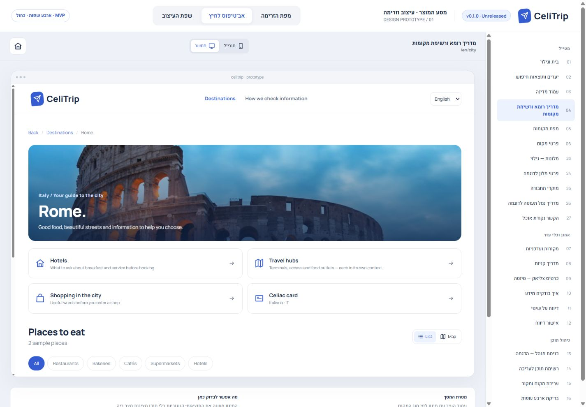
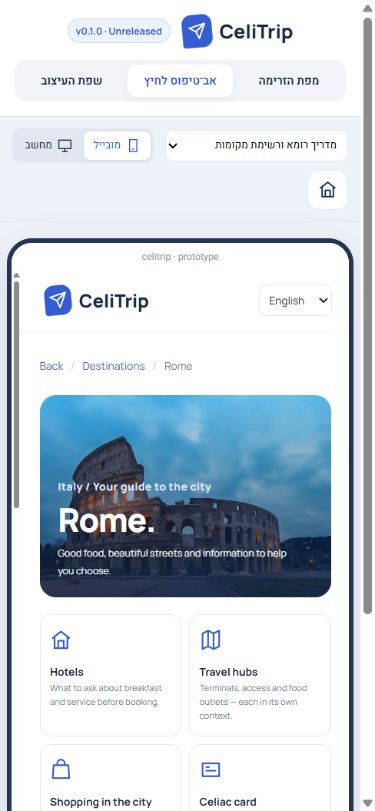
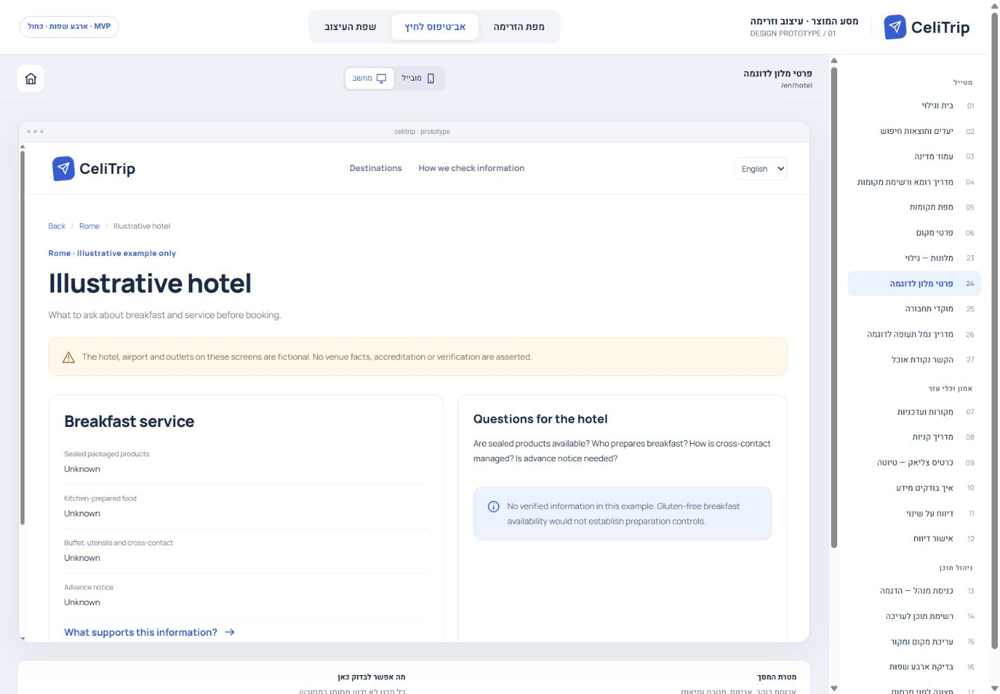
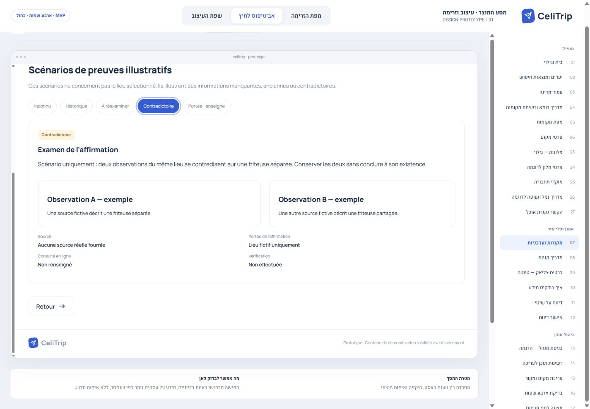
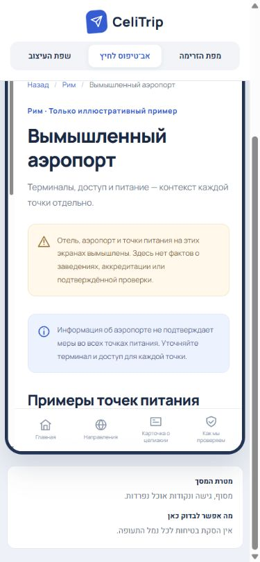
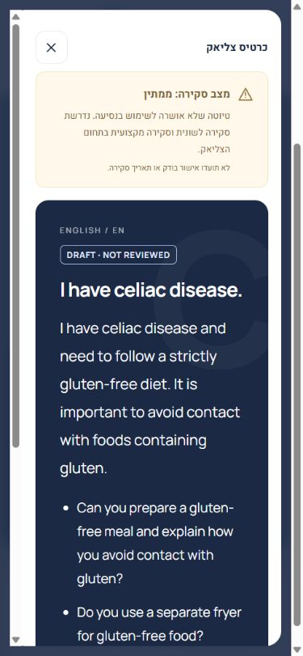

# CeliTrip prototype validation

**Date:** 2026-10-01 · **Scope:** Local design prototype, not production acceptance

**0.2.0 checkpoint follow-up:** The owner-authorized development checkpoint regenerated only the product-version badge from 0.1.0 to **0.2.0 Unreleased**. Current HTML SHA-256: `324c7a8aeac3adf0b00fad58e5085127e6a6d9a30b7114442ddf3141fa8fe3bd`. Reversing just that generated version text exactly reproduces the prior `236fa460…` fingerprint below. Prior flow checks/screenshots remain historical evidence for unchanged behavior; they were not all rerun. See [the checkpoint report](../development/CHECKPOINT_0.2.0.md) for focused badge/display checks. The original validation record below is retained as captured.

The subsequent local Next.js/PostgreSQL Rome implementation has its own [milestone 1 validation report](../technical/MILESTONE_1_VALIDATION.md). The standalone HTML remains unchanged at the fingerprint below; its existing flow evidence is reused. Application tests do not establish implemented hotel, airport, card or editorial capabilities.

Open [CeliTrip-Design-Flow.html](CeliTrip-Design-Flow.html) directly in Chrome. Select a flow-map screen or the clickable-prototype tab, then use the product's language selector and the studio's mobile/desktop controls. All fonts, images, styles and scripts are embedded; there is no install or build step. The surrounding design studio retains its original Hebrew labels.

For automated Chrome inspection, the file was served at `http://127.0.0.1:4173/` by a temporary, loopback-only server that serves only this HTML file. This is a local preview, not a backend or deployment; that URL is available only while the preview process is running.

## Browser coverage and results

### Status reconciliation and version badge follow-up

**Current status: focused Chrome validation completed; not blocked.** The earlier blocked message described the initial absence of a browser connection. After Chrome was connected, the prototype was run and the checks below were completed. A later recap saying validation was still blocked was stale.

The original prototype HTML was last written at 06:59:14 UTC on 2026-10-01. The four flow screenshots were saved between 07:10:02 and 07:14:38 UTC, and `layout-checks.json` at 07:14:12 UTC, all after the final flow edit. The screenshots were reinspected and the JSON confirms 115 observations across all four languages at both widths, with no recorded overflow or broken-image failures. The prior session also captured empty warning/error console results. The screenshots are selected visual evidence, not screenshots of all 115 states.

Version management was subsequently initialized from [VERSION.json](../../VERSION.json), with a generated review badge. The source fingerprints distinguish these two validation scopes:

| Artifact | SHA-256 | Validation scope |
| --- | --- | --- |
| Prototype before version badge | `7f5609272f6041f796d2450d0925e512c017c8d61781798d7c2d8217eea0b1d5` | Existing 115 observations and four flow screenshots |
| Prototype with initial unreleased version badge | `236fa460bc88bfac4010d2290b937191099b4d7c1506701883d8d64386d000a5` | Prior flow evidence reused; new badge checked at 1440 × 1000 and 390 × 844 |

Removing only the generated badge and its new CSS exactly reproduces the first fingerprint, so the established flow checks were not repeated. The new badge reads **v0.1.0 · Unreleased**, is visible at both sizes, and introduces no detected document/product horizontal overflow. Both new screenshots were inspected; Chrome captured no warnings/errors in this follow-up. The review page was opened in English and left available in Chrome.

The version synchronization helper passed consistency, read-only stale detection, regeneration, idempotence and invalid-version checks using a temporary fixture. This records an unreleased development version; it does not record a release, tag, reviewer approval or deployment. Future prototype edits must reassess validation scope against these fingerprints.

### Original flow validation

The supplied prototype was run before editing. Baseline checks covered Rome discovery, a venue, its evidence, language switching and the original card. The existing blue design, fonts, components and embedded assets were retained.

| Check | Result |
| --- | --- |
| Desktop viewport | 1440 × 1000; desktop product frame approximately 1128 CSS px wide |
| Mobile viewport | 390 × 844; mobile product frame approximately 341 CSS px wide inside the studio |
| Interface languages at both sizes | Hebrew (RTL), English, French, Russian (LTR) |
| New route coverage | `hotels`, `hotel`, `hubs`, `hub`, `outlet` |
| Evidence variants | Unknown, historical, needs review, conflicting, chain scope |
| Card variants | Italian/English fallback × short/detailed, in all four interface languages |
| Layout observations | 115 recorded screen/state observations; no detected document/product horizontal overflow or broken displayed images |
| Console | No warnings or errors captured during the completed validation session |

The [layout observations](qa/layout-checks.json) record route labels, headings, interface direction, viewport and product width. This is a focused UI validation pass, not a comprehensive accessibility audit, translation approval or rerun of every prior admin scenario.

Connected journeys exercised:

1. City → hotel discovery → hotel detail → evidence → hotel.
2. City → hub discovery → airport guide → outlet A/B → evidence → outlet/hub. Before/after-security contexts remain distinct and explicitly fictional.
3. Evidence scenario selection and interface-language switching preserve the selected state. Reload and browser back/forward retain the outlet and evidence context through the URL fragment.
4. Card length/language changes preserve the interface language; switching the interface preserves the selected card language. Global card entry after reset asks for the demo destination before showing card text.
5. Enlarged card displays the draft warning before the wording, retains LTR card text in the Hebrew interface, scrolls on mobile, and closes with Escape, returning focus to its launch button.
6. Original bakery filter → New Food → evidence → back → list → map preserves the bakery filter and selected venue after a language change.

## Screenshots inspected

The images below were captured from Chrome and visually inspected for wrapping, direction, hierarchy, warnings and control placement.

## File checks

JavaScript syntax and all 202 four-language copy entries were checked. Embedded fonts, images, map tiles and thumbnail data match the supplied original; outdated flow thumbnails for changed screens use the existing icon fallback. Relative documentation links, strict UTF-8 decoding, whitespace and conflict markers were checked. The Git index SHA-256 remains `aec821f4871b0387ece64633ad352690a7d6efa7f12f8d7463923c0c4831946f`.

## Owner acceptance recorded

The owner confirmed approval of the **current prototype's visual direction and interaction flows** in the task instruction recorded on 2026-10-01. The accepted artifact is the version-badged HTML with SHA-256 `236fa460bc88bfac4010d2290b937191099b4d7c1506701883d8d64386d000a5` above. Its fingerprint was rechecked during technical discovery; no HTML or screenshot changes were made and completed browser checks were reused.

This is design acceptance only. It does not approve interface translations, Italian/English celiac-card wording, real venue evidence, editorial trust/review policies or launch-content readiness. No language or celiac subject-matter reviewer approval is recorded by this acceptance.

## Remaining work

* Human review of interface translations and both card languages; no language or card reviewer approval/date is claimed.
* Reviewed real hotel, hub and outlet content, destination coverage, and claim-specific sources. The original venue data/date is supplied prototype content, not newly verified evidence.
* Acceptance of editorial publication rules and proposed review intervals; named reviewers and authority/branding rights.
* Facility-profile discovery filters, full country/shopping content, production error states and accessibility validation.
* Production implementation, including authenticated editorial roles, durable revisions, translation approvals, correction handling, provider-backed maps and genuine offline card storage. The [technical discovery recommendation](../technical/TECHNICAL_DISCOVERY.md) now documents the proposed implementation; none of these capabilities has been built.

Saving, publishing, reporting and offline/loading screens remain simulations. No production backend, authentication, map subscription, deployment or native Figma screens were added. V1 exclusions and all four launch languages remain unchanged.
